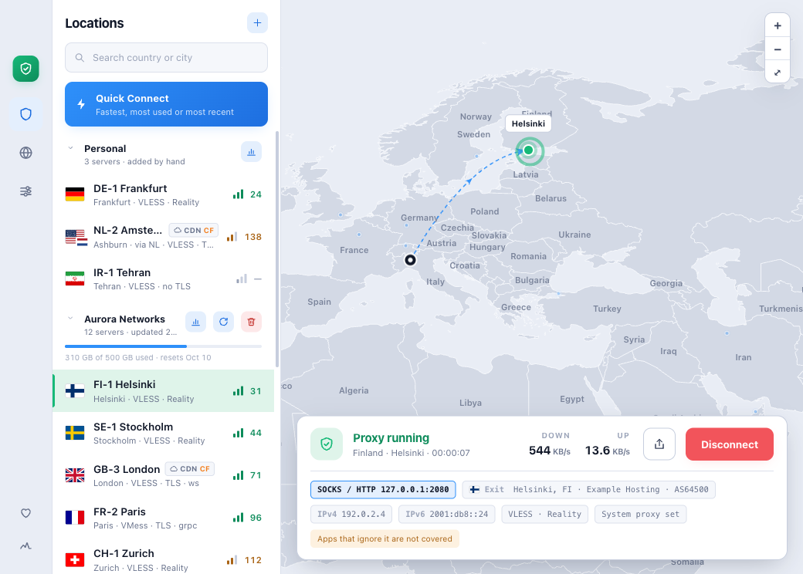
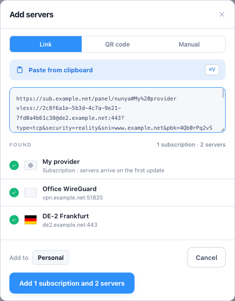
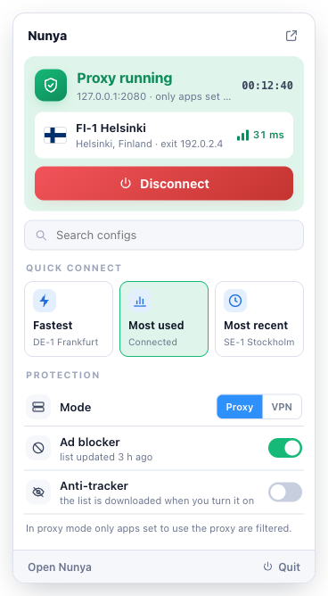
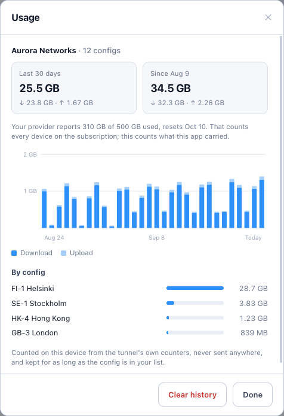

# Nunya

**A VPN client that tells you plainly what it's doing.** 
Safe, fast, reliable, secure and easy to use, and growing into one client for every VPN and proxy protocol.

[**nunya-vpn.com**](https://nunya-vpn.com) · [Download](https://github.com/nunyavpn/nunya/releases) · [Report an issue](https://github.com/nunyavpn/nunya/issues)

 

<picture>
  <source media="(prefers-color-scheme: dark)" srcset="images/main-dark.png">
  
</picture>

Nunya connects you through the VPN and proxy servers you already have, whether that's links a
provider sent you, a subscription or a WireGuard config, and tests every one of them for real.

## What we care about

| | |
| --- | --- |
| **Safe** | Nunya never claims more than it covers. VPN mode carries the whole device; proxy mode says exactly which apps are covered, and which aren't. |
| **Fast** | Every server is tested end to end: how quickly it answers, and where its traffic really comes out. Quick Connect picks the fastest, the one you use most, or the one you used last. |
| **Reliable** | A server only counts as working if traffic actually gets through it, and the shield turns red when a connection is up but nothing comes out. |
| **Secure** | No account and no telemetry. Your servers stay on your device, the engine is a checksum-verified release, and the app and the engine check each other's identity. |
| **Easy to use** | Paste a link or a subscription, scan a QR code, and connect. |

## Today: the client

Nunya is in **beta** for **macOS** (Apple Silicon, 12+), **Windows** (x86-64, 10+) and **Linux**
(`.deb`, `.rpm` and Arch packages). Get it from [nunya-vpn.com](https://nunya-vpn.com) or the
[Releases](https://github.com/nunyavpn/nunya/releases) page; every build comes with a `SHA256SUMS`.

- [**nunya**](https://github.com/nunyavpn/nunya): the desktop app.
- [**nunya-core**](https://github.com/nunyavpn/nunya-core): the engine it runs, built on sing-box and Xray and released on its own so the app can pin a verified version.

What works now:

- **Protocols**: VLESS, VMess, Trojan and WireGuard, Cloudflare WARP included.
- **Transports and security**: TCP, WebSocket, gRPC, HTTP/2, HTTPUpgrade, QUIC and XHTTP, with TLS, Reality and uTLS.
- **Subscriptions**: share-link lists, or whole Xray, sing-box and Clash configurations.
- **Two modes**: a VPN for the whole device, or a local SOCKS/HTTP proxy that can be set as the system proxy while you're connected.
- **A live map** of you, your servers and your route, with each server placed where its traffic really exits.
- **Quick Connect, usage history, bypass rules, an ad blocker and anti-tracker**, and a status shield in the menu bar.
- **Sharing**: send a server as a link, a QR code, or a WireGuard config the official WireGuard apps can scan.

<table>
  <tr>
    <td align="center"></td>
    <td align="center"></td>
    <td align="center"></td>
  </tr>
  <tr>
    <td align="center">Paste a link or a subscription</td>
    <td align="center">Connect from the menu bar</td>
    <td align="center">See what each server carried</td>
  </tr>
</table>

Screenshots show made-up example servers.

## Where it's going

1. **One client for every protocol.** Shadowsocks, Hysteria2, TUIC, SSH, AmneziaWG, OpenVPN and more, plus proxy chains and routing rules. Planned in the open, in the [client's issues](https://github.com/nunyavpn/nunya/issues).
2. **nunya-server-core**: the server side, as a Docker image anyone can run.
3. **nunya-cluster**: many nodes working as one, scaling up and down on their own.
4. **nunya-server-panel**: configs and users managed from one place.

| Repository | What it is | Status |
| --- | --- | --- |
| [nunya](https://github.com/nunyavpn/nunya) | the desktop client | beta |
| [nunya-core](https://github.com/nunyavpn/nunya-core) | the engine | active |
| nunya-server-core | the server, as a Docker image | planned |
| nunya-cluster | multiple nodes, auto-scaling | planned |
| nunya-server-panel | config and user management | planned |

## Open by design

We don't ask you to trust a privacy tool you can't inspect. The client and its engine are
GPL-3.0, and so will be the server software as it arrives. Nunya began as a fork of
[Throne](https://github.com/throneproj/Throne); each repository states its own license.

Bug reports, ideas and pull requests are welcome. Start with the
[open issues](https://github.com/nunyavpn/nunya/issues).

## Supporting Nunya

Nunya is free. Donations are being set up through two channels only, **Buy Me a Coffee** and
**crypto wallets**, and will be listed on [nunya-vpn.com](https://nunya-vpn.com) and in the app.
Anyone asking for payment in Nunya's name anywhere else is not us.
